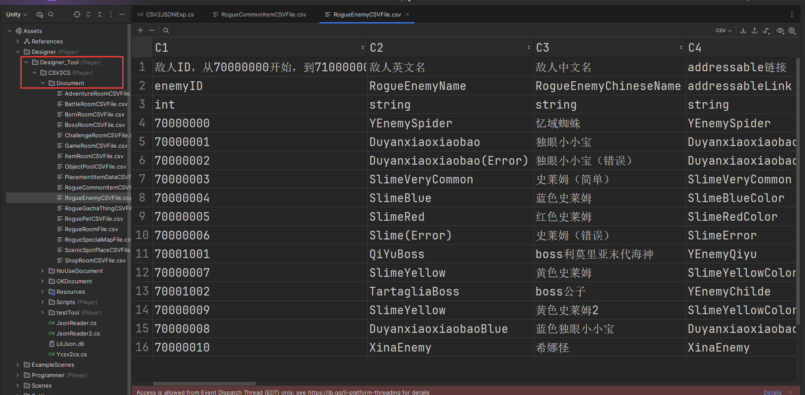

# GameJam 相关工具开发及主要的位置

注：所有的基础架构和有用的内容都被放在了BaseGameArchitectures这个文件夹中，打开这个Unity程序就可以看到每个框架的使用方法和对应的Demo。使用的Unity项目版本为2022LTS版本，我们一般用的是.3的版本。


# 基本配置

> 为了导出的方便，尽量不要使用ScriptableObject！！！用策划表来读取！！

## 1.字体

​	这个在BaseGameArchitectures这个项目里可以看到，用的是Genshin的字体，如果有其他字体的需求可以参考教程：https://www.bilibili.com/video/BV1v5411D79x/?spm_id_from=333.337.search-card.all.click&vd_source=f0e5ebbc6d14fe7f10f6a52debc41c99  这里的章节：制作UI部分。

​	如果TMP_Text一直在报不影响游戏运行的警告，可以考虑在TMP Settings当中勾选Disable warnings，如下图：


## 2.渲染管线：URP

​	没有太多要强调的内容，写的shader代码应当是hlsl的。主要可以交给TA来完成。


## 3.关于UI Panel的设定

​	新做UI的时候，尽量尝试符合全分辨率的配置。我们老的项目目前只支持1920*1080的分辨率，但是打包出来如果是全屏的在某些机型上UI会炸掉。这种适配在新的项目里是需要考虑的，不过由于时间有限暂时没办法学习例如FGUI这种框架（或许可以在GameJam之前把这个学完？），只能说在做UI的时候**尽量用其他的分辨率试一下**，实在不行最后再用`1920*1080`的分辨率强制导出。


## 4.Addressable

​	在项目运作的初期，就需要导入Addressables相关的Package（在Unity Registories里面），用于做美术资源的加载，用法的话已经比较熟悉了，简单贴一下接口使用，比如下面这个：

```c#
var op2 = Addressables.InstantiateAsync(aSimpleMessageUILink, messageKind1Panel);
GameObject go = op2.WaitForCompletion();
go.transform.GetComponentInChildren<TMP_Text>().text = messageContent;
```

​	这样的话只要在相关资源上勾选Addressable的选项卡即可。

**Addressable group的配置**


其中Build选择New Build->Default Build Scripts即可。这个时候可能会报一个Report：


直接点Yes即可。这个Build应该指的是把Addressable在游戏Build的时候也打包出来。


## 5.卡渲Shader

现在项目当中集成了一个卡渲的效果，是Github上NiloCat的仓库，不过如果TA自己写的话也可以搬进来，这个倒是无所谓。要是用现成的卡渲的话参考`UnityURPToonLitShaderExample-master`这个文件夹，需要把Shader设置成：SimpleURPToonLitExample，理论上还需要一些其他的贴图，不过实测其实一张Albedo+描边效果就算不错了，类似下图：


## 6.导出的注意事项

请注意，我们将所有的策划表都放在Designer这个文件夹下面（这里是因为读表工具有一些历史遗留问题），因此在build之后需要做如下的事情：

- 创建一个Assets/文件夹在build的文件夹下，然后把项目中整个Designer文件夹复制进去，如下图：


- 在game_data文件夹中，同样把Designer文件夹复制到里面

只有完成了以上的部分，策划表才能正确的读取，这样build出来的项目才算成功。

------


# 一、策划表转表工具

## 1.CSV策划表转表工具

​	在`BaseGameArchitectures\Assets\Designer\Designer_Tool`路径下面，可以看到这个转表工具的基本结构，把整个Designer_Tool文件夹导入到新项目之后，Unity的界面上就会出现Tools工具栏，把策划表放进Designer_Tool的子文件夹Document中，例如下面这张策划表（注意策划表放的位置）：



​	此时点击工具栏Tools->ExcelToJson，如果没问题的话就可以在代码里直接使用了，如上面这张表的使用方法在代码中可以这样写：

```c#
void Start()
{
    string enemyID = "70000001";
    var enemy = SD_RogueEnemyCSVFile.Class_Dic[enemyID];
    Debug.Log(enemy.EnemyBulletAttribute);
    Debug.Log(enemy.addressableLink);
    Debug.Log(enemy._RogueEnemyStartHealth()); //这个是int类型的，也就是做完类型转换的，一般逻辑用这个
    Debug.Log(enemy.RogueEnemyStartHealth);  //这个是string类型的
}
```

​	这时enemy就可以访问策划表中的所有字段，并且拿到值了。**需要说明的是，策划表的第一个字段往往是key，也就是从Class_Dic里面拿出的字段，并且每个字段要标注参数的类型，目前支持int，string，float等，如果需要其他类型可以用string，然后手动写逻辑对其进行解析。**以下是一个常见的填表字段思路：


常见的使用符号：（分号;表示这是两个不同的逻辑，比如上图       冒号:表示区间范围，   感叹号!表示在分号中再次切分逻辑等），这些符号每个项目倒是可以再改，但重点是要熟悉对应的设计思路。

> 有了这个转表工具，程序就可以快速拿到策划填表的数据，并做接下来的对应逻辑了。
>
> 一个未处理的小问题：**策划表的最后一行不能是空字符串，否则会报错，转表无法成功完成，记得把最后一行开头的空格删掉。**

------


## 2.XML文件读取

​	这里以之前项目的抽卡记录为例，讲述一下解析XML文件的基本思路，并给出核心代码，方便后续项目用**存档之类的功能的时候要使用**。以下面这张XML表为例：


​	上图放的位置有点问题，应该放置在Designer路径下面，和Designer_Tool是平级路径。解析这张XML表的代码可以在`XMLReader.cs`文件中找到，此时读取解析这张XML表的核心逻辑如下：

```c#
void Start()
{
    string gachaSaveXmlPath = Application.dataPath + "/Designer/XMLTable/gachaHistory.xml";
    //加载抽卡的xml文件
    XmlDocument xmlDoc = new XmlDocument();
    //加载抽卡记录
    xmlDoc.Load(gachaSaveXmlPath);
    List<string> names = new List<string>();
    List<string> stars = new List<string>();
    List<string> timeStrs = new List<string>();
    // 获取根节点
    XmlElement root = xmlDoc.DocumentElement;
    XmlNode historyNode = root.SelectSingleNode("GachaHistoryInfo");
    if (historyNode != null)
    {
        XmlNodeList levelsNode = historyNode.SelectNodes("GachaResultNode");
        //Sort by time
        if (levelsNode.Count != 0)
        {
            //取currentPage页的数据，一页显示10个
            for (int i = 0; i < levelsNode.Count; i++)
            {
                names.Add(levelsNode[i].Attributes["name"].Value);
                stars.Add(levelsNode[i].Attributes["star"].Value);
                timeStrs.Add(levelsNode[i].Attributes["timeStr"].Value);
            }
        }
    }
}
```

像是修改XML，往里添加内容的逻辑是这样的：

```c#
private void SaveBaseDataToXmlFile(XmlDocument xmlDoc, string savePath)
{
    //对这些数值进行更新
    int test1 = 100;
    int test2 = 200;
    bool test3 = true;
    bool test4 = true;
    //把已经抽了的抽数保存到Xml文件当中
    XmlElement root = xmlDoc.DocumentElement;
    // 创建新的character节点
    XmlNode historyNode = root.SelectSingleNode("GachaBaseInfo");
    if (historyNode != null)
    {
        XmlNodeList levelsNode = historyNode.SelectNodes("GachaBaseInfoNode");
        if (levelsNode.Count == 0) //还没有抽卡记录，就创建一个新的节点
        {
            XmlElement newGachaBaseNode = xmlDoc.CreateElement("GachaBaseInfoNode");
            newGachaBaseNode.SetAttribute("drawCounter5Star", test1.ToString());
            newGachaBaseNode.SetAttribute("drawCounter4Star", test2.ToString());
            newGachaBaseNode.SetAttribute("isLast5StarCharacterUp", test3.ToString());
            newGachaBaseNode.SetAttribute("isLast4StarUp", test4.ToString());

            // 将新创建的节点添加到levelsNode节点中
            if (historyNode!=null)
            {
                historyNode.AppendChild(newGachaBaseNode);
            }
        }
        else
        {
            foreach (XmlElement xe in levelsNode) 
            {
                xe.SetAttribute("drawCounter5Star", test1.ToString());
                xe.SetAttribute("drawCounter4Star", test2.ToString());
                xe.SetAttribute("isLast5StarCharacterUp", test3.ToString());
                xe.SetAttribute("isLast4StarUp", test4.ToString());
            }
        }
    }
    xmlDoc.Save(savePath);
}
```

​	运行`XMLReader.cs`脚本，可以看到XML文件已经更新了。以后如果需要对XML表进行操作的话也可以参考这个示例程序。

------


## 3.Json文件读取

以以下的Json文件为例，介绍Json文件的读取核心代码（**注意要先去Unity Package那里下载一个叫做Newtonsoft Json的插件，免费的**）：


核心代码如下（在`JsonReaderTest.cs`当中）：

```c#
using System.Collections;
using System.Collections.Generic;
using System.IO;
using System.Text;
using UnityEngine;
using Newtonsoft.Json;
using Newtonsoft.Json.Linq;

public class JsonReaderTest : MonoBehaviour
{
    private string questionPath;
    private List<string> contents = new List<string>();
    private List<string> labels = new List<string>();
    // Start is called before the first frame update
    void Start()
    {
        questionPath = "Assets/Designer/JsonFile/usual_test_labeled.json";
        LoadQuestionFromDataset();
    }
    
    private void LoadQuestionFromDataset()
    {
        string jsonString = File.ReadAllText(questionPath, Encoding.UTF8);
        //seperate each object
        JArray jArray = JArray.Parse(jsonString);
        foreach (JObject obj in jArray.Children<JObject>())
        {
            foreach (JProperty singleProp in obj.Properties())
            {
                if (singleProp.Name == "content")
                {
                    contents.Add(singleProp.Value.ToString());
                }
                else if (singleProp.Name == "label")
                {
                    labels.Add(singleProp.Value.ToString());
                }
                    
            }
        }
    }
}
```

至此，常见的几种策划表和存档、成就等文件的框架就准备好了，有需求的话可以直接拿过来使用。

------


# 二、Manager类的相关内容

​	主要包含对Message类的管理，比如说我们可以支持各种消息类型，

## 1.MessageMgr

### （1）Message表

​	具体可以参考`MessageCommonCSVFile.csv`文件，策划在填写策划表的时候按照这个来填就行，这个表现在没有用转表工具进行转表，而是直接读取csv文件进行解析（历史遗留问题），所以在实际使用中需要注意以下事项：

- 需要把这个表放置在Designer/DesignerTableCommon文件夹里；
- 需要一个`YPlanningTable.cs`文件用于读取这类没有用到转表工具的表，具体的读Message表的代码可以参考范例项目当中的`YPlanningTable.cs`文件。这样所有的message信息就都被存在`YPlanningTable.Instance`当中了；
  - **注意，由于历史遗留问题，如果修改了Message信息表的列排布，一定要记得修改这个cs文件的读取方式（比如判断某一列是什么字段这种）**


### （2）MessageMgr类

​	这个类想要正确使用，首先要把脚本导入到项目中（`HMessageShowMgr.cs`）。

> **注意这里面涉及到YPlayerModeController的逻辑被注释掉了，根据项目不同可能要修改对应的代码以实现锁定玩家输入等操作，同时因为可能没有提交物体的逻辑所以Message6类型现在也被注释掉了，也是根据需求再写**。

​	接下来，需要把HShowMessagePanel给挂载到Canvas的下面（这是一个预制体），然后把UIPrefabs这个文件夹下面的Prefab都设置一下Addressable，这个Message管理类就可以使用了，具体的使用Message使用方法可以参考`HMessageShowExp`这个脚本。以下是每个消息类型的说明（以1920*1080的分辨率为例）：

- 1类型：屏幕上方的消息，可以设置淡入淡出的时间；
- 2类型：教程。**需要注意：教程类的需要额外提供一个勾选上Addressable的Prefab，示例参考Artists/Prefabs/TutotialPrefab中的内容。**记得对应UI的Prefabs下面需要挂载`HUITutorialPage.cs`脚本，参考项目中的范例。
- 4类型：也是屏幕上方弹出的消息，不过相对重要一些，可以用来作为提示使用；
- 5类型：二次确认窗口，需要绑定三个函数，分别对应点击的确认，点击了取消和点击右上角X号的回调函数；
- 9类型：黑屏转场，本质上就是一个黑色的Canvas盖住屏幕，并且有渐入渐出的效果;
- 10类型：带有感叹号的重要提示，比如有Boss有关消息什么的，或者是不想让玩家遗漏的内容；
- 11类型：按键提示，比如说这里提示玩家要按下F键，可以参考`HMessageShowExp`这个脚本；需要在Unity中把对应Icon的按键设置成Addressable，并写到策划表当中。

注：

> 目前像1，4这种类型都是支持MessageOverride的，也就是说可以这样写：`HMessageShowMgr.Instance.ShowMessage("ROGUE_GACHA_NOENOUGH_XINGQIONG", "点击确认!");`这样的话这套消息系统的架构也可以包括一些带有参数的消息，比如说消息弹出玩家的血量、生命值之类的。

------


## 2.AudioManager

这个脚本负责管理音乐的播放，同样需要在场景中的某个物体上绑定AudioManager脚本和YPlanningTable这两个脚本。**注意要播放的音频需要设置成Addressable，并放入到策划表当中。**使用方法可以参考`HAudioManagerExp.cs`这个文件，具体包含的类型为：

- 普通音频播放：`HAudioManager.Instance.Play("RunFootStepOnGround", player.gameObject);`，其中第二个参数是挂载AudioSource的Gameobject，也就是要发声的物体，比如玩家身上的音效就可以挂载玩家上。
- 从音频的某个时间点开始播放：`HAudioManager.Instance.Play("RobinCatcakeBattleAudio", player.gameObject, 85.3f);`
- 停止某个音频，传入的是对应的物体，比如想要停下所有玩家身上的音乐，可以用`HAudioManager.Instance.Stop(player.gameObject);`
- 淡出某个音频，传入的是对应的物体，比如想要淡出玩家身上的音乐，可以用`HAudioManager.Instance.EaseOutAndStop(player.gameObject);`

对于GameJam来说，以上的音频相关的工具应该是够用了。


> 目前AudioManager的缺陷：只支持一个物品同时播放一个声音，如果有其他的项目需求，有如下的解决方案：
>
> - 例如玩家想要播放两个声音，可以把一个声音挂载在玩家子节点上；
> - 重构AudioManager类，有空的话可以搞一下；


## 3.PostProcessingManager

首先，如果想要在项目中开启后处理的话，记得一定要勾选上相机的Rendering-Post Processing选项。这部分的具体示例可以参考PostProcessingExp这个场景。注意`HPostProcessingManager.cs`要挂载在Volume的下面，因为这个脚本里面通过GetComponent获取Volume。


## 4.相机相关

### （1）震屏


# 三、非常好用的插件

## 1.DOTWEEN

需要在Package Manager当中安装一下这个插件，安装完之后打开Panel，选择Set up一下（像3D项目的话不要勾选那个Physics 2D）。这个插件好处多多，常见的接口和需求可以问Copilot或者GPT，一般来说不会有大的问题。


## 2.New Input System

基本上也是标配了，直接导入就行，项目里玩家的移动状态机需要用到这个。记得在Edit->ProjectSettings/Player/Configuration/Active Input Handling选项卡中选择Both，这样新老的Input System就都可以使用了。

InputSystem的Input Action参考L2PlayerInput，后续与玩家状态机有关的代码也会建立在这个之上。（当然我们主要在框架里总结的是CharacterControlls这部分），如下图：


## 3.Cinemachine

不多说，很好用。后面也是基于Cinemachine来进行开发的。


# 四、玩家相关

这个可以参考的场景都在ExampleScenes/Player/ 文件夹当中。

## 1.玩家状态机+动画系统

玩家的基本处理不过多介绍，包括如果是模之屋上的模型，要blender cats插件处理后导入Unity，设置Humanoid这种，在本文档中不再展开。

### （1）Freelook的相机+人物移动

具体参考ExampleScenes/Player/StateMachine/PlayerFreeLookWithStateMachine这个场景。核心代码是挂载在角色身上的HPlayerStateMachine.cs脚本。这里也顺便总结一下思路：

**Freelook相机配置**

项目工程里自带对应的Freelook相机，可以对其修改参数。**注意最好不要自己重新创建Freelook相机，坑还是挺多的，如果手感不好的话调整一下参数应该就可以。**


**状态机**

入口在`HPlayerStateMachine`这个脚本，挂载在角色身上，以及很多的PlayerState，如果要加新的状态，就去抄state即可。动画状态机则有点抽象，不过对于这种Game jam的小型项目来说，能看懂就行。以下是一个状态机：


**如果要给角色加一个技能动作和对应的技能逻辑**

可以参考SkillBase这个脚本，写一个脚本继承于它，但是说实话这样写不是很好（因为SkillBase这里耦合了特效和动画，理论上这应该是两套系统，参考`战斗框架开发.md`），感觉更好的方式是类似于`战斗框架开发.md`里面讲的，用一个完整的操作流来表示技能，GameJam的话结合Dotween和项目需求进行开发应该不会很慢，所以这里就不整理了。

------


### （2）第三人称固定机位的相机

这个对应的场景是ExampleScenes/Player/StateMachine/PlayerThirdPersonExpScene，这里直接拿原来项目当中稍微复杂一点的案例来作为框架，即射击游戏，该场景提供以下特性：

- （a）点击鼠标左键可以切换相机位置，从而方便做射击操作，在GameJam中如果没这个需求把对应的代码删掉即可。
- （b）在按下鼠标左键射击的时候，如果同时按下鼠标右键则可以打开倍镜；
- （c）在按下鼠标左键的时候，屏幕中心会出现一个准星，以及脚本中自带辅助瞄准功能，如果不需要的话可以注释掉或者删掉；
- （d）因为最终的项目不一定是射击的，所以就没有把子弹导入进来，如果还是需要射击的话导进来应该也挺快的。